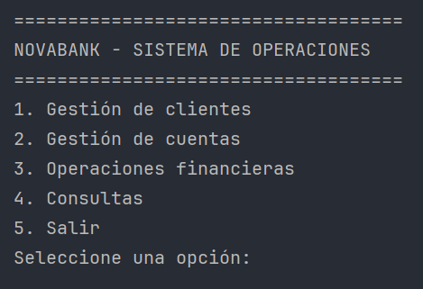
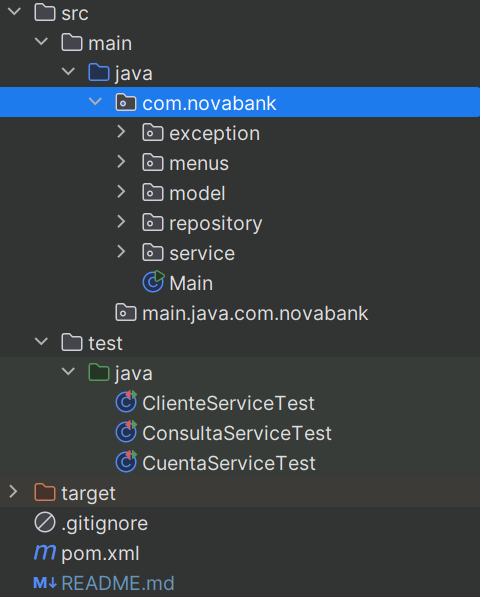
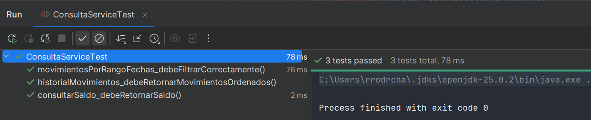

# NovaBank
Sistema bancario en consola desarrollado en Java

---

## Descripción

Aplicación que simula un sistema bancario básico:

    - Gestión de clientes
    - Gestión de cuentas
    - Operaciones financieras
    - Consultas de movimientos

    ✔ Arquitectura por capas
    ✔ Validaciones y control de errores
    ✔ Tests con JUnit

---

## Funcionalidades

CLIENTES
- Alta
- Búsqueda
- Listado

CUENTAS
- Creación
- Consulta

OPERACIONES
- Ingreso
- Retirada
- Transferencia

CONSULTAS
- Saldo
- Movimientos (con filtros)

---

## Arquitectura

MODEL
Entidades del dominio

REPOSITORY
Almacenamiento en memoria (Map)

SERVICE
Lógica de negocio

MENUS
Interacción por consola

---

## Modelo de datos

CLIENTE   1 ─── N   CUENTA   1 ─── N   MOVIMIENTO

---

## Estructura

 
Desplegar estructura:

  

---

## Testing

- ClienteServiceTest
- CuentaServiceTest
- ConsultaServiceTest

Validación de lógica y control de errores

---

## Tecnologías

- Java 17
- Maven
- JUnit 5
- Mockito
- Git + GitHub

## Ejecución

Compilar:

    mvn clean compile

Ejecutar:

    mvn exec:java

Tests:

    mvn test

## Requisitos

- Java 17
- Maven 3.8 o superior

## Codespaces

Ejecución sin instalación local:

    Code → Codespaces → Create Codespace
    mvn exec:java

---

## Repositorio

https://github.com/Rvbenrch/Caso_Practico_NovaBank

---

## Estado

- Funcional
- Testeado
- Preparado para ampliaciones

---

## IMÁGENES (AÑADIR DESPUÉS)

Colocar imágenes en la carpeta:

    /pictures

Añadir en estas secciones:

1. Debajo de "Descripción"
   (captura del menú principal)

2. Debajo de "Funcionalidades"
   (ejemplo de uso o navegación)

3. Debajo de "Testing"
   (tests ejecutándose)

4. Debajo de "Codespaces"
   (entorno en navegador)

Formato a usar:

  

---