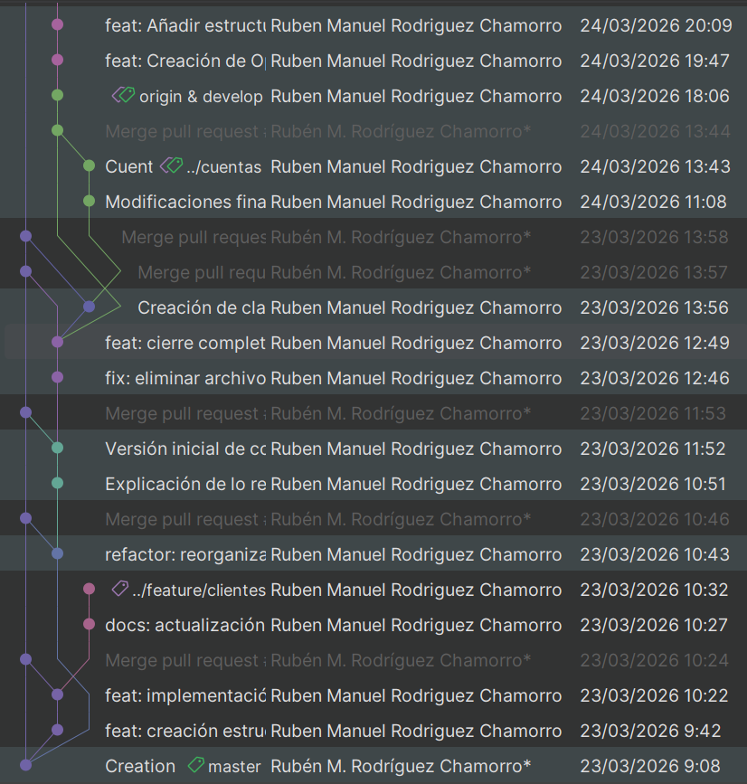

# NovaBank
Sistema bancario en consola desarrollado en Java


---
<details><summary>Caso práctico 1</summary>
    
## Descripción

Aplicación que simula un sistema bancario básico:

    - Gestión de clientes
    - Gestión de cuentas
    - Operaciones financieras
    - Consultas de movimientos

    ✔ Arquitectura por capas
    ✔ Validaciones y control de errores
    ✔ Tests con JUnit

---

## Funcionalidades

CLIENTES
- Alta
- Búsqueda
- Listado

CUENTAS
- Creación
- Consulta

OPERACIONES
- Ingreso
- Retirada
- Transferencia

CONSULTAS
- Saldo
- Movimientos (con filtros)

---

## Arquitectura

MODEL
Entidades del dominio

REPOSITORY
Almacenamiento en memoria (Map)

SERVICE
Lógica de negocio

MENUS
Interacción por consola

---

## Modelo de datos

CLIENTE   1 ─── N   CUENTA   1 ─── N   MOVIMIENTO

---

## Estructura


<details> <summary>Desplegar estructura:</summary>
<p align="center">
  
</p>

</details>

---

## Testing

- modulo1.ClienteServiceTest
- modulo1.CuentaServiceTest
- modulo1.ConsultaServiceTest

Validación de lógica y control de errores


---

## Tecnologías

- Java 17
- Maven
- JUnit 5
- Mockito
- Git + GitHub

## Ejecución

Compilar:

    mvn clean compile

Ejecutar:

    mvn exec:java

Tests:

    mvn test


## Requisitos

- Java 17
- Maven 3.8 o superior

## Codespaces

Ejecución sin instalación local:

    Code → Codespaces → Create Codespace
    mvn exec:java

---

## Repositorio

https://github.com/Rvbenrch/Caso_Practico_NovaBank

---

## Estado

- Funcional
- Testeado
- Preparado para ampliaciones

---

## IMÁGENES FLUJO TRABAJO



---

</details>

# NovaBank – Módulo 2  
Aplicación bancaria en Java con arquitectura por capas, persistencia JDBC y patrones de diseño.

---

##  Arquitectura del sistema

NovaBank adopta una arquitectura por capas que separa responsabilidades y facilita la mantenibilidad, el testing y la extensibilidad del sistema. Esta arquitectura está compuesta por cuatro capas principales: 


Cada capa tiene una responsabilidad clara y no accede directamente a detalles internos de otras capas, cumpliendo la regla de dependencias.

---

##  Requisitos adicionales

Para ejecutar NovaBank correctamente es necesario tener instalado:

- **Java 17 o superior**
- **Maven 3.8+**
- **PostgreSQL 14+** en ejecución
- Base de datos `novabank` creada previamente

---

##  Configuración de la base de datos

### 1. Crear la base de datos

En PostgreSQL:

```sql
CREATE DATABASE novabank;
```

## Ejecutar el script de creación de tablas

```sql
\c novabank;
\i schema.sql;
```

El archivo `schema.sql` se encuentra en la raíz del proyecto e incluye la creación de las tablas:
- Cuentas
- Clientes
- Movimientos

## Configuración de las variables de conexión

En la clase `DatabaseConnectionManager` encargada de centralizar la configuración de acceso a PostgreSQL, se tendrá que editar los valores:

- private static final String URL = "jdbc:postgresql://localhost:5432/novabank";

- private static final String USER = "postgres";

- private static final String PASSWORD = "TU_CONTRASEÑA";

## Ejecución del Sistema

Para compilar el proyecto:


```sql
mvn clean compile
```

Ejecutar la aplicación:

```sql
mvn exec:java
```

Ejecutar los test: 

```sql
mvn test
```
---

## Patrones de diseño aplicados:


Singleton

- Aplicado en `DatabaseConnectionManager`
- Garantiza un único gestor de conexiones
  
Factory

- Implementado en `MovimientoFactory`
- Centraliza la creación de movimientos según su tipo.
  
Builder
- Aplicado en `Cliente.Builder`
- Facilita la construcción de objetos complejos sin múltiples constructores.
  
Strategy
- Implementado en:
    - `IngresoStrategy`
    - `RetiradaStrategy`
    - `TrasnferenciaStrategy`
- Encapsula las operaciones bancarias y evita condicionales repetidos.
  
Decorator
- Implementado en `CuentaServiceVisualDecorator`
- Añade animaciones visuales sin modificar la lógica de negocio.

---

## Estructura del proyecto

```sql
src/
 ├── config/
 ├── menus/
 ├── model/
 ├── repository/
 │    ├── jdbc/
 ├── service/
 │    ├── impl/
 │    ├── strategy/
 │    ├── decorator/
 └── test/
      ├── unit/
      └── integration/
```
## Commits realizados en esta entrega:


---
# Autor

Rubén Manuel Rodríguez Chamorro
Caso Práctico 2 – NTT Data
Universidad de Málaga
Abril 2026

#  Declaración de autoridad

Este proyecto ha sido desarrollado como parte del Caso Práctico 2 del programa formativo de NTT Data. Durante su elaboración se ha hecho uso de herramientas de inteligencia artificial para asistir en la resolución de problemas complejos, acelerar procesos de documentación y mejorar la calidad del código. No obstante, **todas las soluciones generadas por IA han sido revisadas, corregidas y/o modificadas por el autor**, garantizando su validez técnica y su adecuación a los requisitos del módulo.

El código contenido en este repositorio es propiedad intelectual del autor y **no puede ser distribuido, reutilizado ni publicado sin autorización expresa**. Su uso está estrictamente limitado a fines educativos, formativos o de estudio personal. **Cualquier uso fraudulento, no ético o con fines distintos a los educativos será considerado una infracción**, y podrá ser objeto de amonestación académica o administrativa según corresponda.

Si una persona desea utilizar este código para un propósito distinto al aprendizaje —incluyendo proyectos propios, trabajos académicos, repositorios públicos o cualquier actividad que implique reutilización parcial o total— **deberá solicitar permiso explícito al autor antes de hacerlo**.


