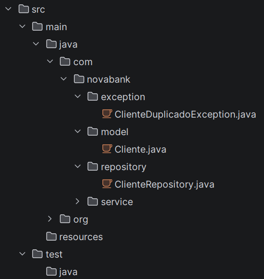

# NovaBank Digital Services

## 📌 Descripción

NovaBank Digital Services es una aplicación de consola desarrollada en Java que simula un sistema básico de gestión bancaria.

En este primer módulo el sistema:

- Funciona completamente en memoria
- No utiliza base de datos
- No implementa autenticación
- Se ejecuta desde consola

El objetivo es centrarse en el modelado del dominio y en la lógica de negocio.

---

## 🏗 Arquitectura actual del módulo

La funcionalidad implementada sigue una estructura en capas sencilla:

### 🔹 1. Capa de Modelo (`model`)

Contiene las clases que representan las entidades del dominio.

**Cliente**

Representa un cliente del banco con los siguientes atributos:

- id (generado automáticamente)
- nombre
- apellidos
- dni (único)
- email (único)
- telefono (único)

Esta clase solo contiene estado y comportamiento básico (getters, setters, etc.).

---

### 🔹 2. Capa de Repositorio (`repository`)

Gestiona el almacenamiento en memoria.

**ClienteRepository**

- Almacena los clientes en una `ArrayList`
- Permite guardar clientes
- Permite buscar clientes por DNI o ID
- Simula el acceso a datos (en este módulo sin base de datos)

Su responsabilidad es únicamente la gestión de datos en memoria.

---

### 🔹 3. Capa de Servicio (`service`)

Contiene la lógica de negocio.

**ClienteService**

- Valida que el DNI no esté duplicado
- Valida reglas básicas antes de crear un cliente
- Utiliza `ClienteRepository` para guardar y recuperar datos

Aquí es donde se centralizan las reglas del negocio.

---

## 🔄 Relación entre las clases

El flujo actual funciona así:

1. El sistema solicita datos al usuario.
2. `ClienteService` recibe esos datos.
3. `ClienteService` valida reglas de negocio.
4. Si todo es correcto, delega en `ClienteRepository`.
5. `ClienteRepository` almacena el cliente en memoria.

ClienteService → usa → ClienteRepository → almacena → Cliente

Esta separación permite:

- Mantener responsabilidades claras
- Facilitar pruebas unitarias
- Preparar el proyecto para futuras mejoras (base de datos en Módulo 2)

---

## ✅ Funcionalidades implementadas

### Gestión de clientes

- Creación de clientes
- Validación de DNI único
- Almacenamiento en memoria mediante ArrayList
- Generación automática de ID
